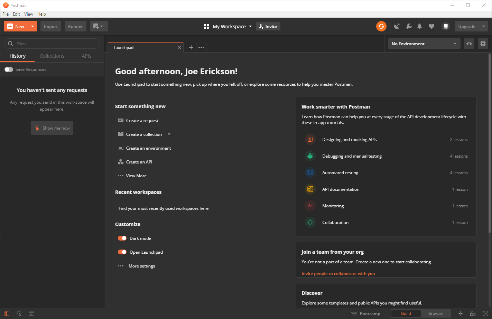
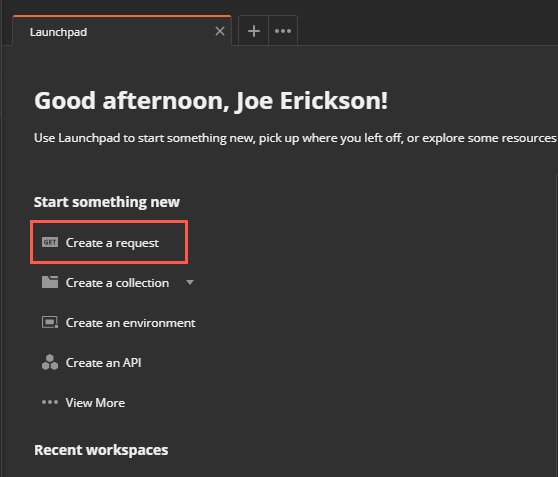
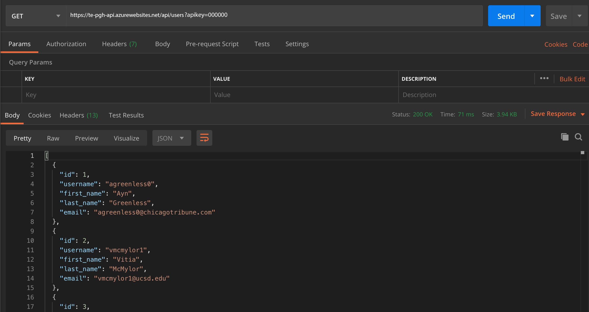
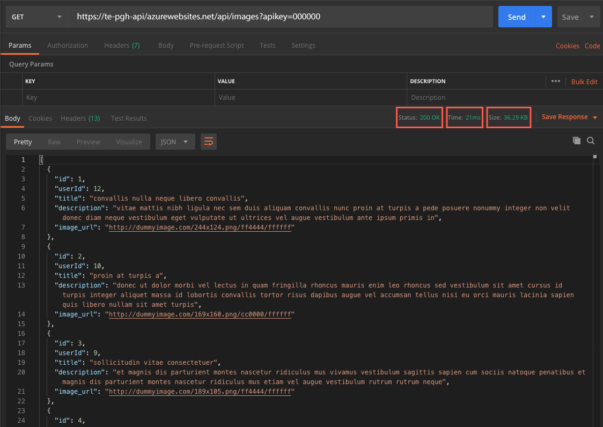
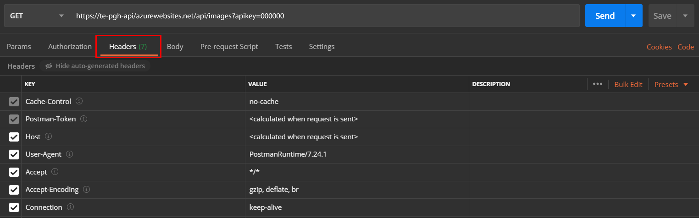
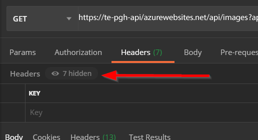
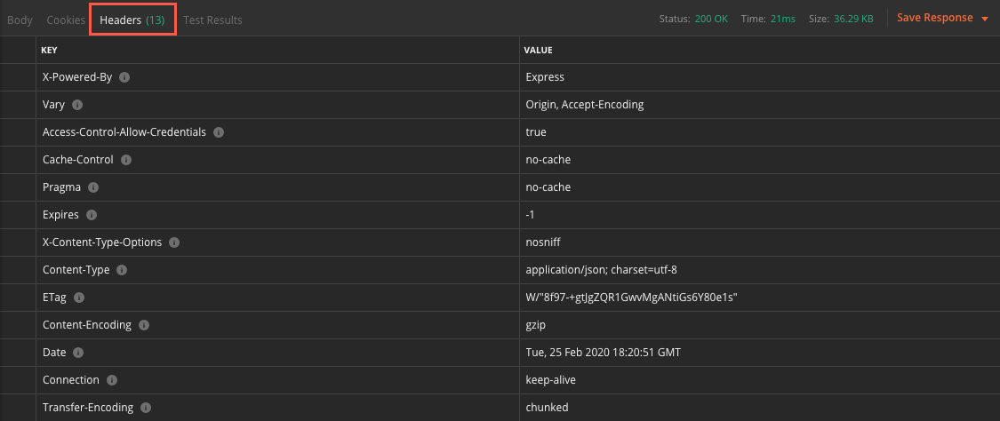

# Tutorial for Postman

In this tutorial, you'll learn how to call a web API using Postman.

## Step One: Identify your API Key

Before you can access the web API, you need a special Key. This Key is called an `API Key`. An `API key` or application programming interface key is a code that gets passed to the web API by the client computer application. In this case, the API key is passed by the command-line application. The `API Key` is used to identify its user, developer or calling program to a website.

In your case, the API Key is the Tech Elevator Inventory Number located on the tag on your laptop. In some cases, that tag is located on the bottom or your laptop.

```
  Resources
  https://te-pgh-api.azurewebsites.net/api/users?apikey=<insert_your_apikey>
  https://te-pgh-api.azurewebsites.net/api/images?apikey=<insert_your_apikey>
  https://te-pgh-api.azurewebsites.net/api/comments?apikey=<insert_your_apikey>

  Type s + enter at any time to create a snapshot of the database
```
## Step Two: Start Postman

Postman should be installed on your laptop already. The icon looks like this in either your start menu or in your Applications folder:


Double-click that icon. You'll see a new screen like this:



Postman is an application that lets you make HTTP requests like a browser but instead shows the raw information returned from the server. When you're interacting with a web server, that information is typically HTML. But when interacting with a web API, that information is usually JSON data, and a browser isn't designed to display that information very well.

Web APIs also typically expect special HTTP headers and status codes that are more complex to set in a browser, so Postman is used in those circumstances. Think of it as your first interface to a Web API.

## Step Three: Create a new request in Postman

In the Postman interface, click the "Create a request" link to start a new API session:



This session records and lets you play back API requests.

For your first request, make a request that returns all the users as an array. The URL for that request is `https://te-pgh-api.azurewebsites.net/api/users?apikey=<insert_your_apikey>`. Enter the URL in the text box and then click send:


In the body tab, you'll see the JSON data for 25 users:



### Modify GET request

If you change the request to `https://te-pgh-api.azurewebsites.net/api/images?apikey=<insert_your_apikey>`, you'll see the image information load in when you click Send.

The Postman interface also shows you three important pieces of information about the request: the returned HTTP Status Code, how long the response took, and the size of the response data:



You can use this information for debugging purposes—for example, how slow the API response is in case you need to compensate for it.

## Step Four: Review request and response headers

Clicking on Headers in the Request section lets you set HTTP headers for the request and see what HTTP headers Postman sets for the request:



Postman sets and auto-generates some of the headers, like the User-Agent and Host. These can be overwritten by your own headers for testing or exercising the back-end API.

>Note: You may need to click the "X hidden" button to show the hidden headers.



You can also see the Response Headers that the server sends back in the Response view:



These are the headers that the server sends back. These can be useful to look at if you need to debug the API.

## Summary

You can now:

- Open Postman
- Make requests in Postman to web APIs
- View and set the HTTP Headers in the request
- View the Response Status Code, response time, size, and headers