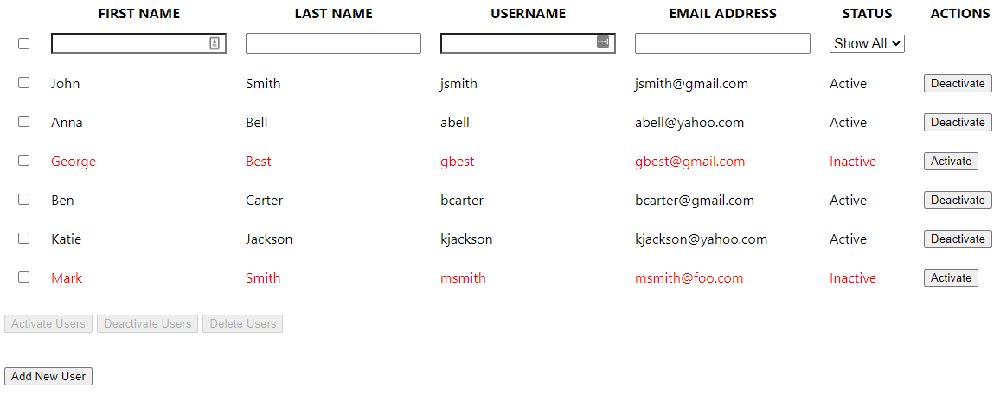
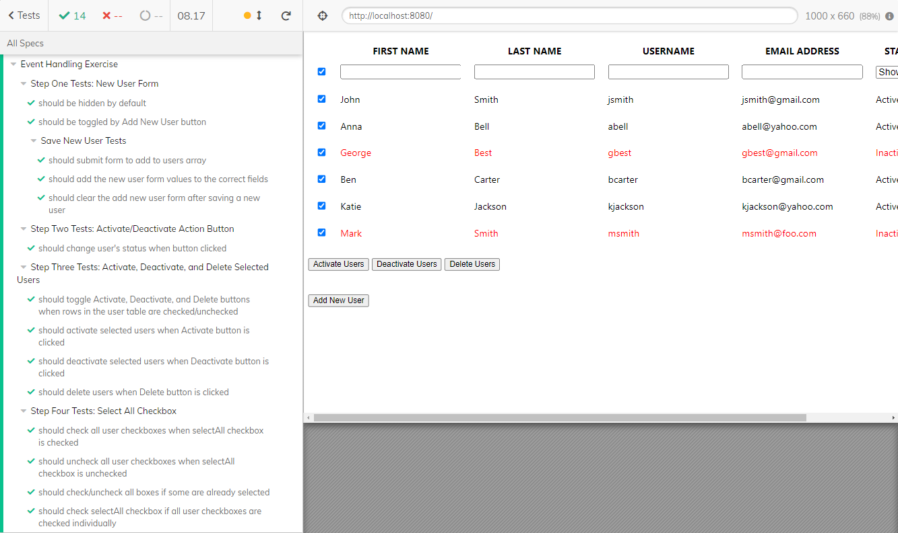

# Vue Event Handling Exercise

In this exercise, you'll build on the previous exercise that asked you to display a list of users in a table. First, you'll start by creating a new user form to add users to the list. Second, you'll add the ability to select one or more users and then perform actions on them such as activating, deactivating, and deleting. This is what the final application looks like:

Before you begin the exercise, run `npm install` to install any dependencies. Run the end-to-end tests with the command `npm run test:e2e` or `npm run test:e2e-headless`.

>**NOTE:** If you work with the page in the browser, refreshing the page causes it to lose any values you entered, boxes you've checked, or any other action you performed since the page doesn't persist changes.

## Step One: Implement the new user form

The markup for the new user form is already in the template. Complete the following tasks:

- Mark the form as hidden by default.
  - Create a property to toggle the visibility of the form when a user clicks the "Add New User" button.
- Bind each form field to the correct property in the `newUser` object.
- Create a method that adds a new user to the `users` array on the form submission.
  - Get an id for the `newUser` object by calling the `getNextUserId()` method.
  - Clear the form after saving the user.

After you complete step one, the tests under "Step One Tests: New User Form" pass.

## Step Two: Make Activate/Deactivate button in action column dynamic

In the "Action" column of the table, there's a button that activates or deactivates the user. Complete the following tasks:

- If the user status is `Active`, the button text displays `Deactivate`.
- If the user status is `Inactive`, the button text displays `Activate`.
- When you click the button, change the user's status from `Active` to `Inactive`, or `Inactive` to `Active`.
  - Tip: Create a method and pass the user ID to it. You can use the user ID to find the user in the users array and change their status.

Once you complete this step, the tests under "Step Two Tests: Activate/Deactivate Action Button" pass.

## Step Three: Activate, deactivate, and delete selected users

There are three buttons following the user listing table. Complete the following tasks associated with those buttons:

- Add a property to track the selected user IDs. Set the default value to an empty array. Bind the property to the checkboxes in the left column (except the top-most one).
- Enable the "Activate Users", "Deactivate Users", and "Delete Users" buttons only when the selected user IDs array isn't empty.
- Activate Users button
  - Sets the status of each selected user to `Active`.
  - Clears all checkboxes when action completes.
- Deactivate Users button
  - Sets the status of each selected user to `Inactive`.
  - Clears all checkboxes when action completes.
- Delete Users button
  - Deletes the user from the `users` array.
  - Clears all checkboxes when action completes.

Once you complete this step, the tests under "Step Three Tests: Activate, Deactivate, and Delete Selected Users" pass.

## Step Four: Implement the "select all" checkbox

The "select all" checkbox is the checkbox on the first row with the filter inputs. Complete the following tasks for the "select all" checkbox:

- When clicked to "checked" state, set all boxes to checked and add all users to the selected user IDs array. When clicked again to "unchecked" state, set all boxes to unchecked and remove all users from the selected user IDs array.
- If some of the boxes are in a checked state, clicking "select all" selects all users. If clicked again, then it deselects all users.
- Check "Select all" when all individual checkboxes get checked.
- Add/remove the user IDs to/from the array depending upon the checked status of all checkboxes.

At this point, all tests pass, as shown here:

