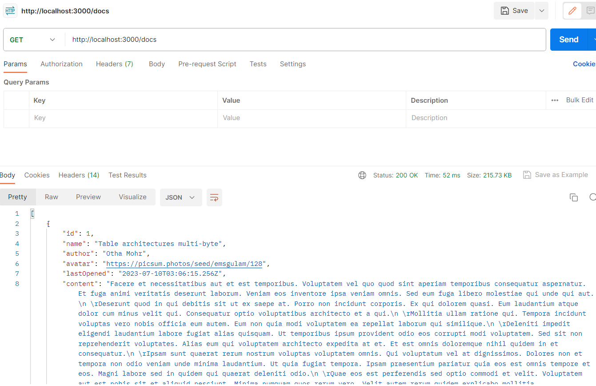

# Web Services (GET) Tutorial

In this tutorial, you'll work on a document listing application. The starting code already contains most of the presentation code. You're responsible for calling the Web API to retrieve a list of documents and details for each one.

## Step One: Run the project

The first thing to do is install any dependencies by running the command `npm install`. If you run the project using the command `npm run dev`, the Vue application starts on port 5173. The `dev` command also starts up a local Web API on port 3000.

## Step Two: Explore the Web API

Before moving to the next step, explore the Web API using Postman. You can access the following endpoints:

- GET: http://localhost:3000/docs
  - A list of all documents.
- GET: http://localhost:3000/docs/{id}
  - Details for a document using the document id.
  - There are 100 documents, each with a unique id from 1 to 100.



## Step Three: Review starting code

Before you get started with the tutorial, take a minute to review the starting code. In `src/router/index.js`, there are two routes set up for `HomeView` and `DocumentView`:

```js
const routes = [
  {
    path: '/',
    name: 'HomeView',
    component: HomeView
  },
  {
    path: '/document/:id',
    name: 'DocumentView',
    component: DocumentView
  }
];
```

The home view `src/views/HomeView.vue` imports and uses the `src/components/DocumentList.vue` component. `DocumentList` has all the code necessary to render an array of document objects.

The `docs` array is currently empty, so your first task is to set up a service object and retrieve a list of documents to populate that array.

## Step Four: Create document service object

You need a document service object to retrieve a list of documents. Start by creating a new folder under `src` called `services` and create a new file called `DocsService.js`.

> Take careful note of the spelling of this filename.

You'll start by importing `axios` and setting the `baseURL`:

```js
import axios from 'axios';

const http = axios.create({
  baseURL: 'http://localhost:3000'
});
```

Next, you'll export a default object with a single method called `list()`. This method uses `axios` to call the document's Web API and return a [`Promise`](https://developer.mozilla.org/en-US/docs/Web/JavaScript/Reference/Global_Objects/Promise):

```js
import axios from 'axios';

const http = axios.create({
  baseURL: 'http://localhost:3000'
});

export default {

  list() {
    return http.get('/docs');
  }

}
```

With the `DocsService` file in place, you can use it in the document list component. Open `src/components/DocumentList.vue` and import the `DocsService` that you just created:

```js
import docsService from '../services/DocsService';

export default {
  ...
};
```

Next, use the `created()` lifecycle hook to call the `list()` method in `DocsService`. The `list()` method returns a promise, and when it resolves, you can set the `docs` array to the response:

```js
import docsService from '../services/DocsService';

export default {
  data() {
    //...
  },
  computed: {
    //...
  },
  methods: {
    //...
  },
  created() {
    docsService.list().then(response => {
      this.docs = response.data;
    });
  }
};
```

If you visit http://localhost:5173, you'll see a list of documents:


When you hover over a table row, you'll notice it's highlighted. If you click the row, it calls the method `viewDocument()`, which uses Vue Router to navigate to the details for that document:

```html
<tr v-for="doc in sortedDocs" v-bind:key="doc.id" v-on:click="viewDocument(doc.id)">
```

```js
viewDocument(id) {
  this.$router.push({name: 'DocumentView', params: { id: id }});
}
```

## Step Five: Create a method to display document details

If you click the first document from the home view, you go to a URL like http://localhost:5173/document/74. Right now, the document detail page has no details:


In `src/router/index.js`, there's a route that matches that path, which loads the document view `src/views/DocumentView.vue`:

```js
  {
    path: '/document/:id',
    name: 'DocumentView',
    component: DocumentView
  }
```

`DocumentView` uses the `src/components/DocumentDetail.vue` component. `DocumentView` reads the data from the API, and `DocumentDetail` displays the document's details. To get those details, create a new method in `services/DocsService.js`, and call it from `DocumentView`.

First, open `src/services/DocsService.js` and add a new method that retrieves a single document by its id:

```js
import axios from 'axios';

const http = axios.create({
  baseURL: 'http://localhost:3000'
});

export default {

  list() {
    return http.get('/docs');
  },

  get(id) {
    return http.get(`/docs/${id}`)
  }

}
```

Next, open `src/views/DocumentView.vue` and import the `DocsService`:

```js
import docsService from '../services/DocsService';

export default {
  components: {
    DocumentDetail
  },
  data() {
    return {
      document: {}
    };
  }
};
```

Finally, use the `created()` method lifecycle hook to call the `get()` method in `DocsService`. Set the view's document property to the response of the Web API call:

```js
import docsService from '../services/DocsService';

export default {
  components: {
    DocumentDetail
  },
  data() {
    return {
      document: {}
    };
  },
  created() {
    docsService
      .get(this.$route.params.id)
      .then(response => {
        this.document = response.data;
      });
  }
};
```

Run the application, then click one of the documents to view the details for that document:


Congratulations, you just hooked up your first Web API to a Vue application.

## Summary

In this tutorial, you learned how to:
- Make an HTTP `GET` request to a Web API using the Axios library.
- Handle the response (Promise) of a Web API request.
- Build a service object for interacting with a Web API.
- Use the `created()` lifecycle hook to call a Web API and retrieve data when the view renders.
