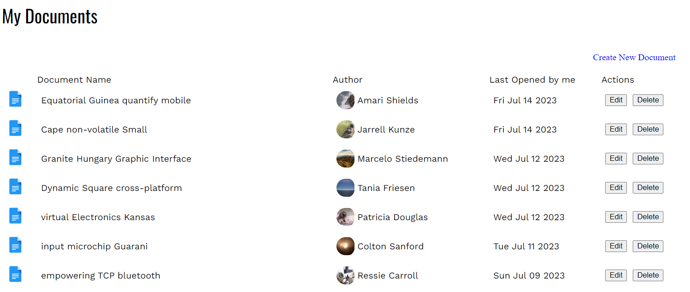

# Web Services (POST) Tutorial

In this tutorial, you'll work with the document listing application you saw in a previous tutorial. You'll add the ability to create, update, and delete documents.

## Step One: Run the project

The first thing to do is install any dependencies by running the command `npm install`. If you run the project using the command `npm run dev`, the Vue application typically starts on port 5173. The `dev` command also starts up a local Web API on port 3000.

## Step Two: Create a new document

Your first task is to create a new document. From the home page, where you see a list of documents, there is a **Create New Document** link in the upper right-hand corner:



When you click the link, you'll see a form with all the fields needed to create a new document. When you click the **Cancel** button, it returns you to the list of the documents. There's currently no code associated with the **Save Document** button. You'll add code to call the API to create a new document.

Open `src/services/DocsService.js` and add a method to take the document as an argument, and `POST` it to your API using Axios:

```js
create(doc) {
  return http.post(`/docs/`, doc);
}
```

Next, open the `AddDocument` component `src/components/AddDocument.vue`. The application calls the `saveDocument()` method when the user clicks **Save Document**:

```html
<button type="submit" v-on:click="saveDocument()">Save Document</button>
```

There's no code in `saveDocument()` yet. You must call the `create()` method of `DocsService`. To do that, first import `DocsService`:

```js
import docsService from '../services/DocsService';

export default {
  // ...
};
```

Call the `create()` method with `this.document` as an argument. When it responds, check for status code `201`, indicating successful creation.

```js
saveDocument() {
  docsService
    .create(this.document)
    .then((response) => {
      if (response.status === 201) {
        this.$router.push({name: 'HomeView'});
      }
    })
},
```

Now run the application. Enter a name, author, and content, then click **Save Document**. After the application creates the document, it redirects you to the home page with the most recent document displayed first.

### Add error handling

You must also handle cases where something goes wrong while creating a new document. Do that with `.catch()`. For this tutorial, you'll report the error on the console:

```javascript
saveDocument() {
  docsService
    .create(this.document)
    .then(response => {
      if (response.status === 201) {
        this.$router.push({name: 'HomeView'});
      }
    })
    .catch(error => {
      console.error(error);
    });
},
```

## Step Three: Update an existing document

Next, you'll allow users to update an existing document. The home page shows an **Edit** button in the table row for each document. When you click this button, the `DocumentView` view loads, which contains the `DocumentDetail` component.

In `src/components/DocumentDetail.vue`, the `saveDocument()` method provides the logic for the **Save Document** button. At the moment, it doesn't do anything:

```html
<button type="submit" v-on:click="saveDocument()">Save Document</button>
```

In `DocsService`, add a method named `update(id, doc)`. It accepts the id of the document to update along with the document object that contains all of its properties and values. This method uses Axios to send a `PUT` request to your API:

```js
update(id, doc) {
  return http.put(`/docs/${id}`, doc);
},
```

The only property you're updating here is the content, but you'll send the entire document object to the API. So, you'll construct one in the `saveDocument()` method. When the `update()` method's promise is fulfilled, verify that the response status is `200` (OK) and forward the user back to `/`:

```js
saveDocument() {
  const current = this.document;
  const doc = {
    id: current.id,
    name: current.name,
    author: current.author,
    avatar: current.avatar,
    content: this.content,
    lastOpened: new Date()
  };
  docsService
    .update(doc.id, doc)
    .then(response => {
      if (response.status === 200) {
        this.$router.push({name: 'HomeView'});
      }
    })
    .catch(error => {
      console.error(error);
    });
}
```

> You may wonder why you must create a new object and can't just update `this.document`. Since `document` is a prop of `DocumentDetail`, it's read-only. You shouldn't update the value of a prop.

If you change the content field and click **Save Document**, it updates and redirects you back to the home page.

## Step Four: Delete a document

The last feature you need to support is the ability to delete a document. If you look at the list of documents, you'll see a **Delete** button in the Actions column for each document. In `DocumentList`, clicking the **Delete** button calls the `deleteDocument()` method, passing the document id:

```html
<button v-on:click="deleteDocument(doc.id)">Delete</button>
```

In `DocsService`, add a method named `delete(id)` that takes the id of the document that you want to delete. This method uses Axios to send a `DELETE` request to your API:

```js
delete(id) {
  return http.delete(`/docs/${id}`);
}
```

In `deleteDocument()`, add a call to this new service method, which verifies that the response returns a status code of `200` (OK), indicating the delete was successful. You still see the document in the list because you need to "refresh" the current list of documents. To do this, call `getDocuments()` to get an updated list of documents:

```js
deleteDocument(id) {
  this.isLoading = true;
  docsService
    .delete(id)
    .then(response => {
      this.isLoading = false;
      if (response.status === 200) {
        this.getDocuments();
      }
    });
}
```

### Add error handling

Suppose two people are looking at the same list of documents. What would happen if one person deleted a document and then the other person tried to delete it? You'll want to add some error handling to the `deleteDocument()` method. Catch the error, and if the status code is `404`—meaning Not Found—redirect the user to the path `/404`, which loads `src/views/NotFoundView.vue`:

```js
deleteDocument(id) {
  this.isLoading = true;
  docsService
    .delete(id)
    .then(response => {
      this.isLoading = false;
      if (response.status === 200) {
        this.getDocuments();
      }
    })
    .catch(error => {
      this.loading = false;
      if (error.response.status === 404) {
        this.$router.push({ name: 'NotFoundView' });
      } else {
        console.error(error);
      }
    });
},
```

> You can test this out yourself by opening your application in another tab and try deleting the same document in both tabs.

## Step Five: More error handling

When you click the **Edit** button to make changes to a document, the `DocumentView` view loads the active document by looking at the id in the URL. What happens if you specify an id that doesn't exist, like `http://localhost:5173/document/23432432`?

You'll see a nearly blank screen and wonder what went wrong. To catch this type of error, add error handling logic. Catch the error, and if the status code is `404`—meaning Not Found—redirect the user to the path `/404`, which loads `src/views/NotFoundView.vue`:

```js
created() {
  docsService
    .get(this.$route.params.id)
    .then(response => {
      this.document = response.data;
      this.isLoading = false;
    })
    .catch(error => {
      this.isLoading = false;
      if (error.response.status === 404) {
        this.$router.push({name: 'NotFoundView'});
      } else {
        console.error(error);
      }
    });
}
```

## Summary

In this tutorial, you learned how to:

- POST: Create a new resource using Axios to POST to your API.
- PUT: Update an existing resource using Axios to call PUT on your API.
- DELETE: Delete a resource using Axios to call DELETE on your API.
- Use Axios to handle errors.
